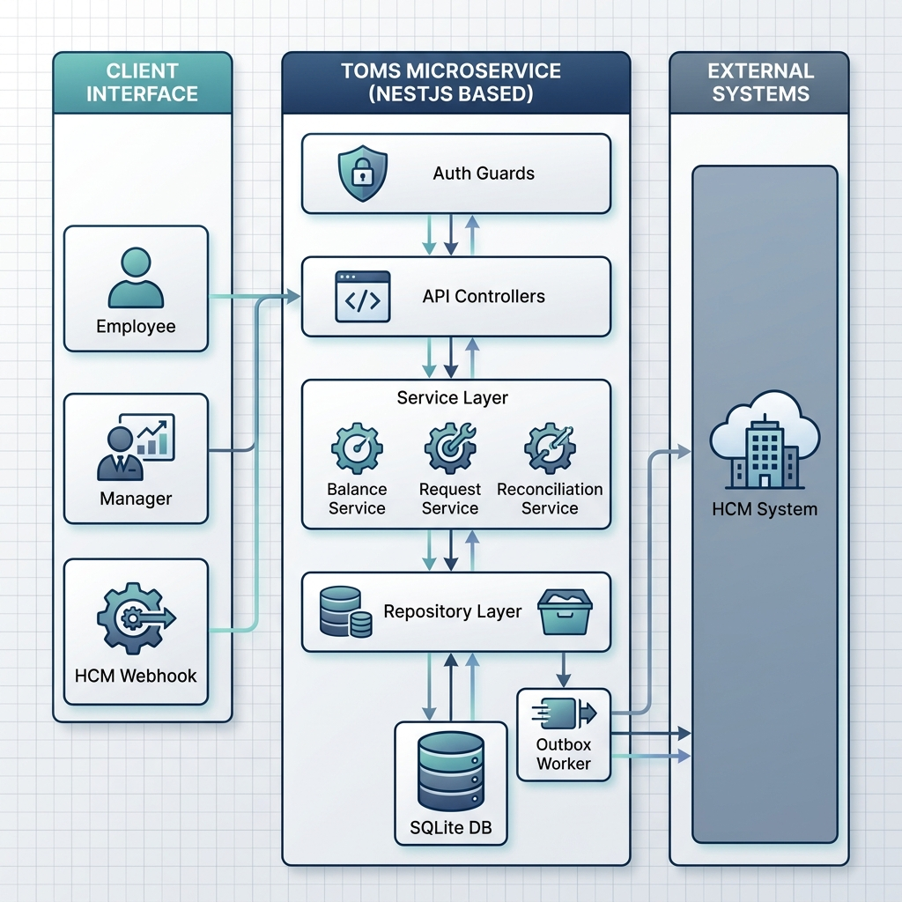

# Technical Requirements Document
## ExampleHR — Time-Off Microservice (TOMS)

**Version:** 1.1  
**Author:** Meesum Abbas  
**Last Updated:** 2026-04-25

---

## Table of Contents

1. [Introduction & Problem Statement](#1-introduction--problem-statement)
2. [Tech Stack](#2-tech-stack)
3. [Detailed Challenges](#3-detailed-challenges)
4. [Proposed Solution](#4-proposed-solution)
   - 4.1 [High-Level Architecture](#41-high-level-architecture)
   - 4.2 [Component Breakdown](#42-component-breakdown)
   - 4.3 [Data Model](#43-data-model)
   - 4.4 [API Surface & Security](#44-api-surface--security)
   - 4.5 [Request Lifecycle & User Flow](#45-request-lifecycle--user-flow)
   - 4.6 [Sync Strategy](#46-sync-strategy)
   - 4.7 [Database Architecture Decision](#47-database-architecture-decision)
   - 4.8 [Rationale & Trade-offs](#48-rationale--trade-offs)
5. [Alternative Approaches Considered](#5-alternative-approaches-considered)
6. [Test Plan](#6-test-plan)

---

## 1. Introduction & Problem Statement

ExampleHR provides employees with a first-class interface for requesting time off. However, the underlying source of truth for all employment data — including leave balances — lives in an external **Human Capital Management (HCM)** system (e.g., Workday, SAP SuccessFactors).

The Time-Off Microservice (henceforth **TOMS**) must bridge these two worlds: it must give employees and managers a fast, reliable, always-accurate view of balances, support the full request lifecycle (submit → manager approval/rejection → deduction), and remain consistent with the HCM at all times — including when the HCM makes changes autonomously (work anniversaries, year-start accruals, manual HR corrections).

**The canonical lifecycle is:**

1. Employee submits a leave request for X days.
2. TOMS immediately checks if available balance ≥ X. If not, the request is rejected instantly.
3. If balance is sufficient, the request is forwarded to the employee's manager for approval.
4. If the manager **approves**, TOMS deducts the days from both the local balance and HCM, and notifies the employee.
5. If the manager **rejects**, no deduction occurs; the employee is notified.

At no point does TOMS deduct from the balance without explicit manager approval. A request enters `PENDING_APPROVAL` and is immediately visible to the manager; the balance is only **hard-deducted** after the manager approves. All pending requests are visible to the manager simultaneously; approval is serialized so the manager can only approve requests that the current balance can cover.

### Actors

| Actor | Core Need |
|---|---|
| **Employee** | See accurate balance; submit requests; get instant feedback on eligibility; be notified of manager decisions |
| **Manager** | Review and approve/reject requests; see accurate balance at decision time; be protected from approving conflicting requests |
| **HR Admin** | Trigger manual syncs; audit history; manage exceptions |
| **HCM System** | Push bulk balance updates; receive confirmed deductions after manager approval |

### System Context Diagram

```
┌──────────────────────────────────────────────────────────────────────┐
│                          ExampleHR Platform                          │
│                                                                      │
│  ┌───────────────┐      ┌──────────────────────────────────────────┐ │
│  │  Employee UI  │◄────►│      Time-Off Microservice (TOMS)        │ │
│  └───────────────┘      │                                          │ │
│                         │  ┌────────────┐   ┌────────────────┐     │ │
│  ┌───────────────┐      │  │  REST API  │   │  Sync Engine   │     │ │
│  │  Manager UI   │◄────►│  │  (NestJS)  │   │  (Scheduler +  │     │ │
│  └───────────────┘      │  └─────┬──────┘   │  Event-based)  │     │ │
│                         │        │          └───────┬────────┘     │ │
│  ┌───────────────┐      │  ┌─────▼──────┐           │              │ │
│  │  HR Admin UI  │◄────►│  │  Service   │◄──────────┘              │ │
│  └───────────────┘      │  │  Layer     │                          │ │
│                         │  └─────┬──────┘                          │ │
│                         │  ┌─────▼──────┐  ┌──────────────────┐    │ │
│                         │  │  SQLite DB │  │  Auth / RBAC     │    │ │
│                         │  │ (WAL mode) │  │  Guard Layer     │    │ │
│                         │  └────────────┘  └──────────────────┘    │ │
│                         └───────────────────────────┬──────────────┘ │
└─────────────────────────────────────────────────────┼────────────────┘
                                                      │
                                         ┌────────────▼──────────────┐
                                         │   HCM System (External)   │
                                         │                           │
                                         │  GET  /balances/:e/:l     │
                                         │  POST /time-off/request   │
                                         │  POST /balances/batch     │
                                         └───────────────────────────┘
```

The guiding principle: **TOMS is a manager-gated write-through cache of HCM balances.** Balances are hard-deducted only after manager approval, and kept accurate via continuous HCM reconciliation. Approval is serialized at decision time — re-validation inside a locked transaction ensures the balance is always sufficient at the moment of approval, regardless of how many requests are pending simultaneously.

---

## 2. Tech Stack

| Layer | Technology | Purpose |
|---|---|---|
| **Runtime** | Node.js 20 (LTS) | Server-side JavaScript runtime |
| **Framework** | NestJS 10 | Structured MVC framework; DI, modules, guards, interceptors |
| **Language** | TypeScript 5 | Type safety across all service and data layers |
| **Database** | SQLite 3 (WAL mode) | Single-file relational DB; serialized writes; zero-infra |
| **ORM** | TypeORM 0.3 | Entity definitions, migrations, repository pattern |
| **Validation** | class-validator + class-transformer | DTO validation on all incoming requests |
| **Auth** | @nestjs/jwt + @nestjs/passport | JWT issuance and verification |
| **RBAC** | Custom NestJS Guards + Decorators | Role enforcement per endpoint (EMPLOYEE, MANAGER, ADMIN) |
| **HTTP Client** | Axios + axios-retry | Outbound HCM calls with automatic retry |
| **Circuit Breaker** | opossum | Fast-fail on sustained HCM outages |
| **Scheduling** | @nestjs/schedule | Cron-based reconciliation and outbox worker |
| **Configuration** | @nestjs/config + Joi | Environment variable management and schema validation |
| **Logging** | Winston (via nest-winston) | Structured JSON logging; audit trail entries |
| **Testing** | Jest + Supertest | Unit and integration test runner |
| **Mock Server** | Express + in-memory state | Fake HCM server for integration and E2E tests |
| **Containerisation** | Docker + Docker Compose | Reproducible local dev and CI environment |
| **Process Manager** | (Docker entrypoint) | NestJS runs as the container's foreground process |
| **API Docs** | @nestjs/swagger | Auto-generated OpenAPI 3.0 spec from decorators |
| **UUID** | uuid v4 | Idempotency keys, primary keys |
| **Date/Time** | date-fns + date-fns-tz | Timezone-safe date arithmetic |

### Docker Compose Topology

```yaml
# compose.yml (illustrative — authoritative file lives in repo)
services:

  toms:
    build: .
    ports:
      - "3000:3000"
    environment:
      - NODE_ENV=development
      - DATABASE_PATH=/data/toms.db
      - JWT_SECRET=${JWT_SECRET}
      - HCM_BASE_URL=${HCM_BASE_URL}
      - HCM_API_KEY=${HCM_API_KEY}
    volumes:
      - toms-data:/data
    depends_on:
      - mock-hcm
    healthcheck:
      test: ["CMD", "curl", "-f", "http://localhost:3000/api/v1/health"]
      interval: 30s
      timeout: 5s
      retries: 3

  mock-hcm:
    build: ./test/mock-hcm
    ports:
      - "4000:4000"
    environment:
      - MOCK_HCM_PORT=4000

volumes:
  toms-data:
```

The `mock-hcm` service is included in compose so that developers can run the full integration test suite locally with a single `docker compose up`. In CI, the same compose file drives the test environment. In production, `mock-hcm` is excluded via an override file (`compose.prod.yml`) and `HCM_BASE_URL` points to the real HCM.

---

## 3. Detailed Challenges

Each challenge is numbered (C-XX) for direct traceability to test cases. Challenges are grouped by domain.

---

### Balance Integrity

#### C-01 — Dual-Write Consistency at Approval Time
When a manager approves a request, two writes must succeed together: the local balance deduction in TOMS **and** the deduction posted to HCM. These are independent systems with no shared transaction boundary.

**Failure modes:**
- Local deduction succeeds, HCM write fails → TOMS shows balance reduced but HCM has not been told; future HCM syncs will restore the balance, creating a phantom-approved request.
- HCM write succeeds, local write fails → HCM is deducted but TOMS shows the request as still pending, and the balance is not reduced locally.
- Service crashes between the two writes.

#### C-02 — Stale Local Balance Leading to False Eligibility at Submission
The HCM can change a balance at any time without notifying TOMS. An HR admin reduces an employee's balance from 10 to 2 days directly in HCM. TOMS still shows 10. The employee submits an 8-day request. TOMS sees sufficient local balance and forwards it to the manager. By the time the manager approves, the HCM will reject the deduction — or worse, silently accept it if HCM validation is unreliable (see C-06).

#### C-03 — Year-Start / Work Anniversary Balance Refresh Race
At midnight on January 1st (or an employee's work anniversary), HCM adds days to the balance. Two edge cases arise:

**Sub-case A:** An employee with zero days submits a request at 11:59 PM on December 31st. TOMS correctly rejects it (zero balance). No issue.

**Sub-case B:** An employee with zero days submits a request at 00:01 AM on January 1st. HCM has already refreshed the balance, but TOMS hasn't synced yet. TOMS still shows zero and incorrectly rejects the request. This is a false negative that the employee cannot explain.

**Sub-case C:** During the batch sync window (which may take seconds to minutes for large tenants), some balances in TOMS are updated while others are not. Requests submitted during this window may be validated against partially-refreshed data.

#### C-04 — Concurrent Requests Exhausting Shared Balance
An employee with 3 days remaining submits a 2-day request from two browser tabs simultaneously. Both requests hit TOMS concurrently:

- Both read `balance_days = 3`.
- Both pass the eligibility check (3 ≥ 2).
- Both are forwarded to the manager as `PENDING_APPROVAL`.
- The manager now sees two pending requests totaling 4 days against a 3-day balance.

This is **intentional behaviour** — the manager sees the full picture and makes an informed choice. What must be prevented is both being *approved*. The approval path is serialized: the approval transaction opens with `BEGIN IMMEDIATE` (SQLite exclusive write lock) and re-validates the live available balance as `balance_days - SUM(days_requested WHERE status = APPROVED AND hcm_request_id IS NULL)`. The first approval succeeds; when the manager attempts to approve the second, re-validation finds insufficient balance and returns a clear error with the updated available balance.

#### C-05 — Manager Approving Two Conflicting Pending Requests
An employee with 3 days submits a 2-day request on Monday. On Tuesday, the employee submits another 2-day request (different dates). Both pass the submission-time check (`balance_days = 3 ≥ 2`) and both enter `PENDING_APPROVAL`. This is by design — the manager sees both requests simultaneously and can make an informed choice about which to approve.

**The manager must never be able to approve both.** Re-validation at approval time is mandatory. At the moment the manager clicks "Approve," TOMS opens a `BEGIN IMMEDIATE` transaction and recomputes available balance. The first approval passes. When the manager attempts to approve the second, re-validation finds insufficient balance and returns `HTTP 409 BALANCE_INSUFFICIENT_AT_APPROVAL` with the current available balance. The second request remains `PENDING_APPROVAL`; the manager can explicitly reject it or the employee can cancel it.

#### C-06 — HCM Validation Unreliability
The spec explicitly requires defensive behavior. HCM may silently fail to return errors for insufficient balances under certain conditions (high load, partial outages, bugs). TOMS must never rely solely on HCM as the final gatekeeper. All eligibility and reservation checks must be performed locally as a pre-condition before any HCM write.

#### C-07 — Balance Changes Between Submission and Manager Approval
The lifecycle of a request can span hours or days. An employee submits a 5-day request when they have 8 days. By the time the manager approves it (two days later), the employee has had another 4-day request approved through a different channel, or an HR admin reduced the balance. TOMS must re-validate available balance at the exact moment of approval — not rely on the eligibility check that was done at submission time.

---

### Synchronisation

#### C-08 — HCM Outage During Approval-Time Deduction
If HCM is unavailable at the moment the manager approves a request, the deduction cannot be posted immediately. TOMS must not leave the request in a permanently stuck state. The approved state must be persisted locally, and the HCM deduction must be retried asynchronously. If retries are exhausted, an alert must be raised for manual intervention.

#### C-09 — Batch Sync Partial Failure
The HCM batch endpoint sends the entire corpus of balances. If the import fails midway (network drop, malformed record, DB error), TOMS may be left with a partially-updated state: some employees have new balances, others have stale values. The import must be atomic: either all records in the batch are applied, or none are.

#### C-10 — Out-of-Order Balance Updates
HCM may deliver balance update events out of order due to network retries or processing delays. Consider:

- HCM sends "balance = 10" (year-start refresh) timestamped T1.
- HCM sends "balance = 8" (post-approval deduction) timestamped T2 > T1.
- TOMS receives the T2 message first, sets balance = 8, then receives T1 and overwrites with 10.

All balance updates must carry HCM-side timestamps. TOMS must apply a "last-write-wins by HCM timestamp" policy — if the incoming record's `asOf` is earlier than `hcm_last_synced`, it must be silently discarded.

#### C-11 — Orphaned Outbox Events on Crash
An approval is committed to the DB and an outbox event is written for the HCM deduction call. The service crashes before the outbox worker processes it. On restart, the event must be picked up and retried. Without this, the approval is stuck: TOMS shows it as approved, HCM has not been debited, and the next sync would "restore" the balance — making the approval appear to have never happened.

#### C-12 — Cancellation After Approval (HCM Credit)
An employee cancels an `APPROVED` request. The HCM has already been debited (or is queued to be debited via the outbox). The cancellation must:
1. Credit back the balance in HCM.
2. Update the local balance.
3. Mark the request as `CANCELLED`.

If the HCM credit call fails, the employee is permanently short-changed. The credit must be retried via the outbox with the same durability guarantees as the original deduction.

---

### Security

#### C-13 — Horizontal Privilege Escalation (Employee Acting as Manager)
An authenticated employee calls `PATCH /requests/:id/approve` or `PATCH /requests/:id/reject`, endpoints that are intended only for managers. Without role enforcement, the employee self-approves their own request, bypassing the manager entirely.

#### C-14 — Employee Approving Their Own Request
Even a legitimate manager role must not be able to approve a request they themselves submitted. An employee who also holds a manager role should not be able to self-approve.

#### C-15 — Spoofing Another Employee's Submission
An authenticated employee calls `POST /requests` with `employeeId` set to a different employee's ID, effectively submitting a request on their behalf or consuming their leave balance.

#### C-16 — Bypassing HCM Freshness Check via Query Parameter
The API exposes a `?refresh=true` parameter on balance reads to force a live HCM fetch. An employee, knowing their local balance is stale (lower than reality), deliberately omits this parameter to use the outdated cached value and gain an illegitimate approval. The system must define when a freshness check is mandatory regardless of the client's request parameters.

#### C-17 — Accessing Another Tenant's Data
TOMS serves multiple customer organisations. An authenticated user from Tenant A constructs requests for employees belonging to Tenant B (e.g., by guessing UUIDs or using a known employee ID pattern). Without tenant-scoping on every query, cross-tenant data leakage or manipulation is possible.

#### C-18 — Replay Attack on HCM Batch Webhook
The HCM batch sync endpoint (`POST /sync/balances/batch`) is called by the HCM system. An attacker who intercepts a legitimate batch payload can replay it later to overwrite current balances with stale data — effectively rolling back all recent deductions. The endpoint must be protected against replay.

#### C-19 — Mass Assignment / Parameter Pollution
A malicious employee submits a `POST /requests` body with additional fields such as `status: "APPROVED"`, `decidedBy: "manager_id_123"`, or `days_requested: 0.001`. Without strict DTO whitelisting, the ORM may persist these values directly, silently approving the request or corrupting balance arithmetic.

#### C-20 — Rate Limiting, Submission Flooding, and Pending Request Cap
An employee submits hundreds of leave requests per second (scripted), either to DoS the TOMS service or to exploit a race condition. Without rate limiting, this saturates the DB writer and potentially triggers concurrency bugs. Additionally, a legitimate employee may accumulate many open `PENDING_APPROVAL` requests simultaneously — some of which are duplicates or contradictory. Without a pending-request cap, a manager's queue becomes unmanageable and the approval-time re-validation aggregate becomes expensive.

Two enforcement mechanisms apply:
1. **Time-based rate limit** — a sliding-window counter (keyed on `userId`) caps submission throughput.
2. **Pending-request cap** — at submission time, TOMS counts the employee's active `PENDING_APPROVAL` requests. If the count is already at the maximum (default: **10**), the submission is rejected with `HTTP 429 PENDING_REQUEST_LIMIT_REACHED` before any balance or freshness check is run. This is a count-based, not time-based, constraint.

---

### Data Integrity & Edge Cases

#### C-21 — Invalid Dimension Combinations (Location × Employee × Leave Type)
HCM balances are scoped per employee per location. Certain leave types may not be valid for certain location/employee combinations (e.g., parental leave for a location where the policy does not apply). TOMS must validate dimension combinations before forwarding to the manager — not rely solely on HCM to catch this (C-06).

#### C-22 — Timezone Handling for Date Boundaries
Leave days are calendar dates, not timestamps. An employee in UTC+5 (Pakistan Standard Time) submitting a request for "today" at 01 AM local time is submitting for a different calendar date than the UTC wall clock suggests. The employee must supply their timezone (or TOMS must derive it from their location profile). All date arithmetic — including day counting and boundary checks — must use the employee's local timezone, not the server clock.

#### C-23 — Fractional Day Requests and Rounding
Some HCM configurations allow half-day leave. Balance arithmetic must use `DECIMAL(8,2)` throughout. Integer arithmetic (e.g., `Math.floor`) on day counts would silently corrupt fractional balances. All comparisons and deductions must use decimal-aware arithmetic.

#### C-24 — Audit Trail Completeness
Every balance change — from an employee request, manager decision, cancellation, batch sync, or spot reconciliation — must be logged with: actor, timestamp, source system, previous value, new value, and a reference to the causative entity (request ID, batch job ID). This is both a compliance requirement and the primary debugging tool for "why does my balance show X?" tickets.

---

## 4. Proposed Solution

### 4.1 High-Level Architecture

TOMS is a single NestJS service with a SQLite database, a synchronous request path for employee-facing operations, a manager approval path with re-validation, and an asynchronous sync engine for HCM reconciliation. All endpoints are protected by JWT authentication and role-based access control.



#### High-Level System Flow (ASCII Reference)
```
          ┌─────────────────┐       ┌───────────────────────────┐       ┌─────────────────┐
          │ CLIENT INTERFACE│       │   TOMS (NESTJS SERVICE)   │       │ EXTERNAL SYSTEMS│
          └────────┬────────┘       └─────────────┬─────────────┘       └────────┬────────┘
                   │                              │                              │
 Employee HTTP ────┤        ┌─────────────────────┴──────────────────┐           │
 Manager  HTTP ────┼───────►│  AUTH, RBAC & RATE LIMIT GUARDS        │           │
 HCM Webhook   ────┘        └─────────────────────┬──────────────────┘           │
                                                  │                              │
                                         ┌────────▼────────┐                     │
                                         │ API CONTROLLERS │                     │
                                         └────────┬────────┘                     │
                                                  │                              │
                                         ┌────────▼────────┐                     │
                                         │ SERVICE LAYER   │                     │
                                         │(Balance/Req/Rec)│                     │
                                         └────────┬────────┘                     │
                                                  │                              │
                                ┌─────────────────┼──────────────────┐           │
                                │                 │                  │           │
                        ┌───────▼──────┐  ┌──────▼───────┐  ┌───────▼──────┐     │
                        │ REPOSITORY   │  │ OUTBOX WORKER│  │ HCM CLIENT   │ ◄───┤
                        │ (TYPEORM)    │  │ (ASYNC)      │  │ MODULE       ├───► │
                        └───────┬──────┘  └──────────────┘  └──────────────┘     │
                                │                                                │
                        ┌───────▼──────┐                                         │
                        │ SQLITE DB    │                                         │
                        └──────────────┘
```

---

### 4.2 Component Breakdown

#### Auth & Security Layer (Guards)

Three NestJS guards stack on every route:

**JwtAuthGuard** — Verifies the Bearer token on every request. Rejects with 401 if missing or expired. Attaches the decoded `{ userId, tenantId, role }` payload to the request context.

**RbacGuard** — Checks the authenticated user's role against a `@Roles(...)` decorator on the controller method. Rejects with 403 if the role is insufficient. Role hierarchy: `EMPLOYEE < MANAGER < ADMIN`.

**OwnershipGuard** — For employee-scoped endpoints (e.g., `POST /requests`, `GET /balances/:employeeId`), verifies that the `employeeId` in the route or body matches the authenticated user's `userId`. A user may not act on behalf of another employee. Managers are exempted from ownership checks only on their own team's requests — they may not access other teams' requests.

**TenantScopeInterceptor** — An NestJS interceptor (not a guard) that automatically appends `tenantId = req.user.tenantId` to all DB queries. This runs transparently in the repository layer and cannot be bypassed by the client. (C-17)

**RateLimitGuard** — Two complementary limits enforced at submission time (C-20):
- **Throughput limit**: sliding-window counter keyed on `userId`, stored in-memory (or SQLite for persistence across restarts). Default: 10 submissions per user per minute.
- **Pending-request cap**: before the freshness check, TOMS counts active `PENDING_APPROVAL` requests for the employee. If `COUNT(*) >= 10`, rejects immediately with `HTTP 429 PENDING_REQUEST_LIMIT_REACHED`. This keeps the manager queue manageable and bounds the cost of the approval-time re-validation aggregate.

#### API Layer (Controllers)

Three controller groups, each thin (validation only, no business logic):

- **BalanceController** — Read employee balances.
- **TimeOffRequestController** — Submit, approve, reject, cancel requests.
- **SyncController** — Admin-triggered manual syncs and HCM batch webhook receiver.

All inputs are typed DTOs decorated with `class-validator`. The `ValidationPipe` with `whitelist: true` and `forbidNonWhitelisted: true` is applied globally — any extra fields in the body are stripped and cause a 400. (C-19)

#### Service Layer

**BalanceService**  
Manages the local balance cache. Key methods:
- `getAvailableAtApproval(tenantId, employeeId, locationId, leaveType)` — Returns `balance_days - SUM(days_requested WHERE status = APPROVED AND hcm_request_id IS NULL)`. Called inside the approval transaction to determine whether approval can proceed.
- `refreshFromHcm(...)` — Fetches live balance from HCM, applies out-of-order protection, writes to DB, writes audit log.
- `isFresh(balance)` — Returns `true` if `hcm_last_synced > NOW() - FRESHNESS_TTL` (default: 15 minutes).

**TimeOffRequestService**  
Owns the request lifecycle state machine (see 4.5). Key responsibilities:
- Pre-submission eligibility check: verifies `balance_days ≥ days_requested` with mandatory freshness enforcement. Does **not** modify any balance column at submission time.
- Re-validation at manager approval time using a live aggregate query inside a `BEGIN IMMEDIATE` transaction (C-04, C-05, C-07).
- Self-approval prevention (C-14).
- Outbox event creation inside DB transactions.

**HcmSyncService**  
Orchestrates all outbound HCM calls via the HCM Client. Adds idempotency key management and dead-letter handling.

**ReconciliationService**  
Background cron-driven service. Fetches HCM balances for recently-active employees and corrects divergences.

#### HCM Client Module

A tenant-aware HTTP client built on Axios:
- Injects per-tenant credentials from the `tenants` table.
- `axios-retry` configured for 3 retries on 5xx and network errors, with exponential backoff (500ms → 1s → 2s).
- `opossum` circuit breaker per tenant: opens after 5 consecutive failures, half-opens after 30 seconds.
- All outbound calls include an `X-Idempotency-Key` header (UUID stored in `outbox_events`).
- Full request/response logged to the audit trail (C-24).

#### Outbox Worker

A `@nestjs/schedule` interval job that runs every 5 seconds:
1. Queries `outbox_events WHERE status = 'PENDING' ORDER BY created_at LIMIT 10`.
2. For each event, calls the appropriate HCM operation.
3. On success: marks event `DONE`, updates request status, writes audit log.
4. On retriable error: increments `attempt_count`, backs off.
5. After 5 failed attempts: marks event `DEAD_LETTER`, raises alert.

The outbox guarantees at-least-once HCM delivery. Idempotency keys on HCM calls ensure double-delivery is safe.

---

### 4.3 Data Model

```
┌──────────────────────────────────────────────────────────────────┐
│ TABLE: tenants                                                   │
│  id            UUID PK                                           │
│  name          TEXT NOT NULL                                     │
│  hcm_base_url  TEXT NOT NULL                                     │
│  hcm_api_key   TEXT NOT NULL  (encrypted at rest via AES-256)    │
│  webhook_secret TEXT          (HMAC secret for batch endpoint)   │
│  created_at    DATETIME                                          │
└──────────────────────────────────────────────────────────────────┘

┌──────────────────────────────────────────────────────────────────┐
│ TABLE: users                                                     │
│  id            UUID PK                                           │
│  tenant_id     UUID FK → tenants                                 │
│  employee_id   TEXT   (HCM identifier)                           │
│  email         TEXT                                              │
│  role          ENUM: EMPLOYEE | MANAGER | ADMIN                  │
│  manager_id    UUID FK → users NULL  (this user's manager)       │
│  timezone      TEXT  (IANA timezone string, e.g. Asia/Karachi)   │
│  location_id   TEXT  (default HCM location)                      │
│  created_at    DATETIME                                          │
│                                                                  │
│  UNIQUE(tenant_id, employee_id)                                  │
└──────────────────────────────────────────────────────────────────┘

┌──────────────────────────────────────────────────────────────────┐
│ TABLE: leave_balances                                            │
│  id               UUID PK                                        │
│  tenant_id        UUID FK → tenants                              │
│  employee_id      TEXT                                           │
│  location_id      TEXT                                           │
│  leave_type       TEXT                                           │
│  balance_days     DECIMAL(8,2)                                   │
│  hcm_last_synced  DATETIME                                       │
│  updated_at       DATETIME                                       │
│                                                                  │
│  available_days (computed live at approval time):                │
│    = balance_days                                                │
│      - SUM(days_requested WHERE status = APPROVED                │
│             AND hcm_request_id IS NULL)                          │
│  UNIQUE(tenant_id, employee_id, location_id, leave_type)         │
└──────────────────────────────────────────────────────────────────┘

┌──────────────────────────────────────────────────────────────────┐
│ TABLE: time_off_requests                                         │
│  id                UUID PK                                       │
│  tenant_id         UUID FK → tenants                             │
│  employee_id       TEXT   (must match authenticated user)        │
│  location_id       TEXT                                          │
│  leave_type        TEXT                                          │
│  start_date        DATE                                          │
│  end_date          DATE                                          │
│  days_requested    DECIMAL(8,2)                                  │
│  status            ENUM:                                         │
│                      PENDING_APPROVAL   ← waiting for manager    │
│                      APPROVED           ← manager approved;      │
│                                           HCM deduction queued   │
│                      REJECTED           ← manager rejected       │
│                      CANCELLED          ← employee cancelled     │
│                      FAILED             ← HCM deduction failed   │
│                                           after max retries      │
│  idempotency_key   UUID  (for HCM deduction call)                │
│  hcm_request_id    TEXT NULL  (HCM's reference, post-deduction)  │
│  submitted_at      DATETIME                                      │
│  decided_at        DATETIME NULL                                 │
│  decided_by        UUID NULL FK → users  (manager)               │
│  failure_reason    TEXT NULL                                     │
│  updated_at        DATETIME                                      │
└──────────────────────────────────────────────────────────────────┘

┌──────────────────────────────────────────────────────────────────┐
│ TABLE: balance_audit_log                                         │
│  id              UUID PK                                         │
│  tenant_id       UUID FK → tenants                               │
│  employee_id     TEXT                                            │
│  location_id     TEXT                                            │
│  leave_type      TEXT                                            │
│  previous_days   DECIMAL(8,2)                                    │
│  new_days        DECIMAL(8,2)                                    │
│  delta           DECIMAL(8,2)                                    │
│  source          ENUM: SUBMISSION | APPROVAL | REJECTION |       │
│                        CANCELLATION | BATCH_SYNC |               │
│                        SPOT_SYNC | MANUAL_SYNC | RECONCILIATION  │
│  reference_id    UUID NULL                                       │
│  actor           TEXT  (user UUID, "SYSTEM", or "HCM")           │
│  recorded_at     DATETIME                                        │
└──────────────────────────────────────────────────────────────────┘

┌──────────────────────────────────────────────────────────────────┐
│ TABLE: outbox_events                                             │
│  id              UUID PK                                         │
│  tenant_id       UUID FK                                         │
│  event_type      ENUM: HCM_DEDUCT | HCM_CREDIT | HCM_SYNC        │
│  payload         JSON                                            │
│  idempotency_key UUID UNIQUE                                     │
│  status          ENUM: PENDING | PROCESSING | DONE | DEAD_LETTER │
│  attempt_count   INTEGER DEFAULT 0                               │
│  last_attempted  DATETIME NULL                                   │
│  created_at      DATETIME                                        │
└──────────────────────────────────────────────────────────────────┘
```

**Key design choices:**

- `balance_days` on `leave_balances` is the sole balance column. There is no reservation counter. `available_days` is computed live at approval time: `balance_days - SUM(days_requested WHERE status = APPROVED AND hcm_request_id IS NULL)`. This runs inside a `BEGIN IMMEDIATE` transaction that serializes concurrent approval attempts for the same employee, preventing over-deduction (C-04, C-05).
- `decided_by` FK to `users` enables the self-approval check: `WHERE decided_by != submitted_by`.
- `idempotency_key` on requests ensures the HCM deduction call is safe to retry (C-11).
- `webhook_secret` on tenants enables HMAC verification of batch payloads (C-18).

---

### 4.4 API Surface & Security

Every endpoint carries three mandatory headers: `Authorization: Bearer <jwt>`, `X-Tenant-ID`, and (for state-mutating calls) `Content-Type: application/json`.

#### Authentication & Role Matrix

| Endpoint | EMPLOYEE | MANAGER | ADMIN |
|---|---|---|---|
| `GET /balances/:employeeId` | Own only | Own + team | All |
| `POST /requests` | Self only | Self only | — |
| `GET /requests/:id` | Own only | Own + team | All |
| `PATCH /requests/:id/approve` | ✗ | Team only, not own | All |
| `PATCH /requests/:id/reject` | ✗ | Team only, not own | All |
| `PATCH /requests/:id/cancel` | Own, if PENDING_APPROVAL | — | All |
| `POST /sync/balances/batch` | ✗ | ✗ | HMAC-signed HCM only |
| `POST /sync/balances/trigger` | ✗ | ✗ | ADMIN only |
| `GET /admin/audit` | ✗ | ✗ | ADMIN only |

**Self-approval prevention (C-14):** The `PATCH /requests/:id/approve` handler checks `request.employee_id !== authenticatedUser.id`. If the same user submitted and is trying to approve, it returns 403 with reason `SELF_APPROVAL_FORBIDDEN`.

**OwnershipGuard on POST /requests (C-15):** The body's `employeeId` is compared against `req.user.userId`. Any mismatch returns 403 `EMPLOYEE_ID_MISMATCH`.

**Freshness enforcement (C-16):** Before forwarding any request to the manager, the service checks `balance.hcm_last_synced`. If the balance is older than `FRESHNESS_TTL` (15 minutes, configurable), a live HCM refresh is performed automatically — the client has no mechanism to suppress this. The `?refresh=true` parameter on `GET /balances` is additive (force-refresh even if fresh), not a bypass mechanism; it is never consulted in the submission path.

**HMAC verification on batch webhook (C-18):** `POST /sync/balances/batch` computes `HMAC-SHA256(rawBody, tenant.webhook_secret)` and compares it to the `X-HCM-Signature` header. Requests with missing or mismatched signatures are rejected with 401. The payload also includes a `nonce` field; TOMS stores processed nonces for 24 hours and rejects duplicates.

**Global ValidationPipe (C-19):** Configured with `whitelist: true` (strips unknown fields) and `forbidNonWhitelisted: true` (rejects requests containing unknown fields with 400). Status, decidedBy, and all server-managed fields are never part of any input DTO.

#### Endpoints

```
── Balances ──────────────────────────────────────────────────────

GET  /api/v1/balances/:employeeId
     Auth: EMPLOYEE (own) | MANAGER (team) | ADMIN (all)
     Query: ?locationId=X&leaveType=Y
     Returns all matching balances with freshness metadata.
     Note: does NOT auto-refresh; use ?refresh=true to force.

GET  /api/v1/balances/:employeeId/:locationId/:leaveType
     Auth: same as above
     Returns single balance. `available_days` is computed live as
     `balance_days - SUM(approved-but-not-yet-deducted requests)`.

── Requests ──────────────────────────────────────────────────────

POST   /api/v1/requests
       Auth: EMPLOYEE (self only)
       Body: { locationId, leaveType, startDate, endDate, timezone }
       employeeId is taken from JWT, never from the body.
       Returns: 202 Accepted { requestId, status: "PENDING_APPROVAL" }

GET    /api/v1/requests/:requestId
       Auth: request owner | manager of owner | ADMIN

GET    /api/v1/requests
       Auth: EMPLOYEE (own) | MANAGER (team) | ADMIN (all)
       Query: ?employeeId=X&status=PENDING_APPROVAL&from=DATE&to=DATE

PATCH  /api/v1/requests/:requestId/approve
       Auth: MANAGER (team, not own request) | ADMIN
       Body: { managerId }  ← validated against JWT; must match
       Triggers re-validation, then outbox HCM_DEDUCT event.

PATCH  /api/v1/requests/:requestId/reject
       Auth: MANAGER (team) | ADMIN
       Body: { reason }

PATCH  /api/v1/requests/:requestId/cancel
       Auth: request owner only; status must be PENDING_APPROVAL

── Admin / Sync ──────────────────────────────────────────────────

POST   /api/v1/sync/balances/batch
       Auth: HMAC-signed HCM webhook only (no JWT)
       Body: { tenantId, nonce, records: [{ employeeId, locationId,
               leaveType, days, asOf }] }

POST   /api/v1/sync/balances/trigger
       Auth: ADMIN only
       Triggers a full pull-sync for the authenticated admin's tenant.

GET    /api/v1/admin/audit
       Auth: ADMIN only
       Query: ?employeeId=X&from=DATE&to=DATE&source=BATCH_SYNC

GET    /api/v1/health
       Auth: none
       Returns DB connectivity status + HCM reachability per tenant.
```

---

### 4.5 Request Lifecycle & User Flow

#### State Machine

```
                     ┌────────────────┐
                     │   [submitted]  │
                     └───────┬────────┘
                             │ balance check fails
                             ├────────────────────────► HTTP 422 INSUFFICIENT_BALANCE
                             │                          (no record created)
                             │ balance check passes
                             ▼
                     ┌────────────────────┐
                     │  PENDING_APPROVAL  │
                     └───────┬────────────┘
                             │
              ┌──────────────┼──────────────┐
              │              │              │
         Manager        Manager       Employee
         Approves       Rejects       Cancels
              │              │              │
              ▼              ▼              ▼
       ┌──────────┐   ┌──────────┐   ┌──────────────┐
       │ APPROVED │   │ REJECTED │   │  CANCELLED   │
       │(HCM      │   │          │   │              │
       │ deduct   │   │          │   │              │
       │ queued)  │   │          │   │              │
       └──────┬───┘   └──────────┘   └──────────────┘
              │
    ┌─────────┴──────────┐
    │  Outbox Worker     │
    │  calls HCM         │
    ├────────────────────┤
    │ HCM success        │──► balance_days -= X; hcm_request_id set
    │                    │    status remains APPROVED
    │ HCM failure        │──► retry → dead letter → FAILED
    │ (after max retry)  │    alert raised; manual intervention needed
    └────────────────────┘
```

#### Full Submission Flow

```
Employee submits POST /requests
        │
        ▼
[JWT + RBAC + Ownership Guards]
  employeeId from JWT (not body) — C-15
        │
        ▼
[DTO Validation — whitelist: true] — C-19
        │
        ▼
[Pending Request Cap Check] — C-20
  COUNT(time_off_requests WHERE employee_id = ? AND status = PENDING_APPROVAL)
  If COUNT >= 10:
    → HTTP 429 PENDING_REQUEST_LIMIT_REACHED
      { message: "Maximum 10 pending requests allowed", currentPending: N }
        │
        ▼
[Freshness Check — mandatory]
  If balance.hcm_last_synced > 15 min:
    → call HCM GET /balances and refresh — C-16
        │
        ▼
[Lightweight Availability Check]
  Check: balance_days ≥ days_requested
  If not:
    → HTTP 422 INSUFFICIENT_BALANCE — C-02 protected by freshness step
  Note: No balance column is modified. Multiple concurrent requests against
  the same balance pool all pass if balance_days ≥ days_requested each.
  Serialization happens at approval time (C-04, C-05).
        │ passes
        ▼
[Begin SQLite Transaction]
  a. INSERT time_off_requests (status = PENDING_APPROVAL)
  Commit
        │ committed
        ▼
HTTP 202 Accepted { requestId, status: "PENDING_APPROVAL" }
        │
        ▼ (async — notification service, out of TOMS scope)
Manager is notified of pending request
```

#### Manager Approval Flow

```
Manager calls PATCH /requests/:id/approve
        │
        ▼
[JWT + RBAC Guard: role = MANAGER or ADMIN]
[Ownership Guard: request.manager_id = authenticatedUser.id]
[Self-Approval Guard: request.employee_id ≠ authenticatedUser.id] — C-14
        │
        ▼
[Re-Validate Balance at Approval Time] — C-07
  Re-fetch leave_balances for this employee
  Re-run freshness check; refresh from HCM if stale
  Compute available_days (live aggregate, inside BEGIN IMMEDIATE lock):
    = balance_days
      - SUM(days_requested WHERE status = APPROVED
             AND hcm_request_id IS NULL)
  If available_days < days_requested:
    → HTTP 409 BALANCE_INSUFFICIENT_AT_APPROVAL
      (response includes current available_days and list of competing
       approved-but-not-yet-deducted requests)
        │ passes
        ▼
[Begin SQLite Transaction — BEGIN IMMEDIATE (serializes concurrent approvals)]
  a. UPDATE time_off_requests SET status = APPROVED,
       decided_by = managerId, decided_at = NOW()
  b. INSERT outbox_events (HCM_DEDUCT, idempotency_key = request.idempotency_key)
  Commit
        │
        ▼
HTTP 200 OK { requestId, status: "APPROVED" }
        │
        ▼ (async — outbox worker)
[HCM Client] POST /time-off/request
  with X-Idempotency-Key
        │ HCM success
        ├──────────────────────────────────►
        │  UPDATE leave_balances:
        │    balance_days -= days_requested
        │    SET hcm_request_id = <hcm ref>
        │  outbox_event.status = DONE
        │  INSERT balance_audit_log
        │
        │ HCM error (4xx — invalid dims / insufficient)
        ├──────────────────────────────────►
        │  UPDATE request.status = FAILED
        │  outbox_event.status = DEAD_LETTER
        │  INSERT balance_audit_log (FAILED source)
        │  Alert HR Admin
        │
        │ HCM 5xx / timeout → retry with backoff
```

#### Batch Balance Sync Flow

```
HCM calls POST /sync/balances/batch
        │
        ▼
[HMAC-SHA256 signature verified] — C-18
[Nonce checked against processed_nonces — replay protection] — C-18
        │
        ▼
[Phase 1: Validate all records (no writes)]
  Any structurally invalid record → HTTP 400, reject entire batch — C-09
        │
        ▼
[Begin SQLite Transaction]
  For each record:
    if record.asOf <= balance.hcm_last_synced: skip (out-of-order) — C-10
    else: UPSERT leave_balances; INSERT balance_audit_log
  Commit
        │ any error
        ├──────────────────────────────────► Rollback entire transaction — C-09
        │
        │ success
        ▼
HTTP 200 { synced: N, skipped: M }
```

---

### 4.6 Sync Strategy

TOMS uses a **three-layer sync strategy** to maintain balance accuracy.

**Layer 1 — Mandatory Pre-Submission Refresh**  
Before checking availability for a new request, TOMS always checks `hcm_last_synced`. If the balance is older than `FRESHNESS_TTL`, a live HCM fetch is performed before the eligibility check. This is not optional and cannot be suppressed by the client (C-16). This ensures the eligibility check is always against a confirmed HCM value.

**Layer 2 — Post-Approval HCM Write (via Outbox)**  
Every approved deduction is written to HCM via the outbox. This keeps TOMS and HCM aligned after every manager decision.

**Layer 3 — Scheduled Spot Reconciliation**  
A background cron job (default: every 15 minutes) selects all balances where `hcm_last_synced < NOW() - 30 minutes` or where a `PENDING_APPROVAL` request exists. It fetches current HCM balances and applies corrections. Divergences greater than 0.5 days are logged as `RECONCILIATION_DRIFT` and flagged to the HR Admin if the drift exceeds 5 days.

**Layer 4 — Full Batch Import**  
Received via webhook or scheduled pull. Processes atomically as described in 4.5.

---

### 4.7 Database Architecture Decision

**Decision: Single SQLite instance, WAL mode, single writer.**

**Why not a primary + read replica?**  
The access pattern for TOMS is per-employee: an employee reads only their own balance, and the read volume per second even across hundreds of employees at a single tenant is very low. There is no read scaling problem. More critically, read replicas introduce replication lag. If a manager approves a request and the next read goes to a replica that hasn't caught up, the balance still shows the pre-deduction value. This creates visible inconsistency at exactly the moment correctness matters most. By reading from the single writer, we guarantee read-your-own-writes semantics.

**Why not multi-leader writes?**  
Multi-leader write topologies are appropriate when writes must survive regional partitions. TOMS is a single-region service with no geo-distribution requirement. Multi-leader write conflicts on the `balance_days` column — which requires exact atomic decrements at approval time — would be catastrophic and could not be resolved by a simple last-write-wins policy. Serialized writes via a single writer are far simpler and provably correct for this workload.

**Why SQLite with WAL mode specifically?**  
The spec mandates SQLite. WAL (Write-Ahead Logging) mode allows concurrent reads while a write is in progress, which matches TOMS's access pattern exactly: many concurrent balance reads (by employees loading their dashboard) with infrequent serialized writes (requests, approvals, sync events). The single-writer model naturally linearizes all balance mutations, making the optimistic locking semantics (`WHERE version = :v`) reliable without additional coordination infrastructure.

**Scale-out path:** TypeORM's database driver is configuration-only. Migrating from SQLite to PostgreSQL for a multi-instance deployment requires changing `DATABASE_TYPE=postgres` and the connection string — no application code changes. This migration point is well-defined and deferred deliberately, not overlooked.

---

### 4.8 Rationale & Trade-offs

#### Why this architecture is correct for the problem

**Manager-gated deduction eliminates a class of balance errors.** Deducting at submission time and then "reversing on rejection" creates a window where the balance is wrong (employee sees reduced balance before manager decides). By deferring all balance writes to approval time, `balance_days` always reflects committed decisions. Pending requests are visible to the manager but do not touch `balance_days` until explicitly approved.

**Approval-time serialization solves the concurrent-approval problem.** By deliberately allowing all requests through at submission, managers see the employee's complete pending leave picture and can make an informed choice. Serialization happens at the approval step: the transaction opens with `BEGIN IMMEDIATE` (exclusive SQLite write lock), re-validates available balance as `balance_days - SUM(approved-but-not-yet-deducted requests)`, and fails with a precise error if the balance is insufficient. Two simultaneous approval attempts for the same employee are sequenced by the single SQLite writer — the second will fail with a clear message rather than silently over-deducting (C-04, C-05).

**Re-validation at approval time closes the time-of-check/time-of-use gap.** A submission check is a snapshot. The approval check is the actual commit point. By re-running the full eligibility check (including a freshness refresh if the balance is stale) at approval time, TOMS ensures that manager approval is always based on current, accurate data (C-07).

**Transactional Outbox solves the dual-write problem without distributed transactions.** Writing the outbox event and the local state change in the same SQLite transaction means either both are committed or neither are. The worker provides durable at-least-once HCM delivery. Idempotency keys make retries safe.

**Defense-in-depth security.** The three-guard stack (JWT → RBAC → Ownership) means there is no single point of security failure. An employee who somehow acquires a manager JWT still cannot approve their own requests (self-approval guard). A manager who somehow knows another tenant's employee IDs still cannot access their data (tenant-scoped queries). Each layer independently enforces a constraint.

#### Cons and limitations

- **Single SQLite writer serializes all mutations.** Under very high write load (many employees submitting requests simultaneously), writes queue behind the single writer. For the expected scale of a tenanted leave management system, this is not a practical bottleneck. For a high-throughput scenario, PostgreSQL would be the first migration step.
- **Async HCM deduction means the employee and manager cannot see a "confirmed by HCM" status immediately after approval.** The manager sees `APPROVED`; the HCM deduction happens seconds later via the outbox. This is acceptable UX for a leave management system, but the UI should display a "processing" indicator until `hcm_request_id` is populated.
- **In-memory rate limiting does not persist across restarts.** A service restart resets all rate limit counters. For DoS protection, this is acceptable (the restart window is brief); for strict per-user enforcement across rolling deployments, a SQLite-backed counter table would be needed.
- **Managers may see multiple competing pending requests.** An employee with 3 days can submit two 2-day requests; both appear in the manager's queue. Only one can be approved; the second approval attempt will fail with `BALANCE_INSUFFICIENT_AT_APPROVAL`. The UI must surface the employee's current `balance_days` and all competing pending requests on the approval screen so the manager understands the situation before clicking Approve.

---

## 5. Alternative Approaches Considered

### A — Immediate Deduction at Submission (No Manager Gate)

**What it does in TOMS:** When an employee submits a request, TOMS immediately deducts the balance and posts to HCM in the same flow, before the manager has acted. The request is marked `PENDING_APPROVAL` with the balance already reduced. If the manager rejects, a credit is issued.

**Benefits over proposed solution:** Simpler state machine (no reservation counter). HCM is always in sync with submitted (not just approved) requests.

**Why not chosen:** This inverts the business semantics. An employee's leave is not committed until a manager approves it. Deducting at submission means the balance shown to the employee and manager is based on unconfirmed requests — a manager may reject five requests in a row and the employee sees their balance "bounce back" five times. It also means every submission involves an HCM write, coupling submission latency to HCM availability. The chosen approach achieves the same double-booking protection without touching HCM until approval is confirmed.

---

### B — Soft-Reservation at Submission Time (Considered and Rejected)

**What it does:** When an employee submits a request, `reserved_days` is atomically incremented on `leave_balances` using an optimistic lock. Subsequent submissions check `available_days = balance_days - reserved_days`; if insufficient, the second submission is rejected before reaching the manager. Each pending request holds a counter that counts against the available balance.

**Benefits over proposed solution:** Available balance is trivially computed without a join. Employees receive immediate feedback at submission if another pending request has already consumed the available balance.

**Why not chosen:** This hides competing requests from the manager, reducing their visibility into the employee’s full leave situation. A manager who sees only one pending request has less context than one who sees two competing requests and can understand the trade-off. The chosen approach (all requests forwarded; serialized at approval) gives managers complete situational awareness and lets them make informed decisions — for example, approving a shorter request and rejecting a longer one the balance cannot cover.

Additionally, soft-reservation requires maintaining a denormalized counter (`reserved_days`) that must stay consistent across four state transitions: submission (increment), rejection (decrement), cancellation (decrement), and HCM deduction completion (decrement `balance_days`, clear reservation). An inconsistency in any of these — e.g., a crash between two updates — silently corrupts `available_days`. The chosen approach derives available balance from `time_off_requests.status` at approval time, a single canonical source of truth with no denormalization risk.

---

### C — Synchronous HCM Call at Submission (No Outbox)

**What it does in TOMS:** When a manager approves a request, TOMS calls HCM synchronously within the HTTP request lifecycle and only returns a 200 to the manager once HCM confirms. No outbox, no async worker.

**Benefits over proposed solution:** The manager sees a "HCM confirmed" status immediately. Simpler operational model (no background worker to monitor).

**Why not chosen:** This couples the manager's HTTP response time directly to HCM latency (often 200–800ms for enterprise HCM systems) and availability. If HCM is down for 2 minutes, every manager approval attempt during that window returns a 503, and managers must manually retry. The outbox approach gives managers instant confirmation of their decision; the HCM write happens durably in the background. The only downside (the "processing" indicator in the UI) is cosmetic compared to the availability and UX costs of the synchronous approach.

---

### D — Event-Driven Architecture with an External Message Broker

**What it does in TOMS:** Replaces the SQLite outbox worker with a dedicated message broker (e.g., RabbitMQ). When a manager approves a request, TOMS publishes a `RequestApproved` event to the broker. A separate consumer service subscribes to this event, calls HCM, and publishes a `HcmDeductionConfirmed` event back. TOMS subscribes to this to update the request's final status.

**Benefits over proposed solution:** The broker provides backpressure, dead-letter queues, and fan-out (multiple consumers can react to the same event — e.g., a notification service, an analytics service, and the HCM sync consumer all subscribe to `RequestApproved` independently). Scales horizontally without the single-writer constraint.

**Why not chosen:** This adds a substantial operational dependency (the broker itself must be deployed, monitored, and kept highly available) that is not justified by the scale or the number of consumers at this stage. The Transactional Outbox pattern achieves functionally equivalent at-least-once delivery guarantees using only the existing SQLite database. If TOMS grows to require multiple independent consumers of approval events, extracting the outbox into a broker is a well-defined migration with no data model changes required — the `outbox_events` table becomes the broker's input topic.

---

### E — Event Sourcing for Balance Management

**What it does in TOMS:** Instead of a `leave_balances` table with a current value, TOMS maintains an append-only `balance_events` log (`BalanceReserved`, `BalanceDeducted`, `BalanceCredited`, `BalanceRefreshed`). The current balance is derived by replaying all events for an employee. A materialized view table caches the computed balance and is updated after each new event.

**Benefits over proposed solution:** The audit log falls out naturally from the event log — there is no separate `balance_audit_log` table because every state change is itself a first-class event. Time-travel queries (what was the balance at 3 AM on January 1st?) are trivial. Full replay capability allows re-deriving balances from scratch if a bug is discovered.

**Why not chosen:** Introduces significant architectural complexity — event schema design and versioning, projection maintenance, snapshot management for replay performance, and eventual consistency in the materialized view. The `balance_audit_log` table in the proposed solution provides all the audit and compliance benefits at a fraction of the complexity. For a leave management system serving thousands of employees, event sourcing would be engineering overkill. The proposed solution's audit trail is sufficient for compliance and debugging, and its correctness is easier to reason about and test.

---

## 6. Test Plan

The test strategy prioritizes correctness of concurrent state and security enforcement over breadth of happy-path coverage. Since TOMS uses Agentic Development (no manual code authoring), the test suite is the primary quality gate.

### Test Pyramid

```
             ┌──────────────────────┐
             │  E2E / Contract (10%)│  Full stack: NestJS + SQLite + mock HCM server
             └──────────────────────┘
         ┌──────────────────────────────┐
         │   Integration Tests (40%)    │  Service + real DB + mock HCM client
         └──────────────────────────────┘
     ┌──────────────────────────────────────┐
     │         Unit Tests (50%)             │  Service logic, state machines, guards
     └──────────────────────────────────────┘
```

### Test Categories

**Unit Tests** cover: lifecycle state machine transitions; live-aggregate `available_days` computation at approval time; concurrent approval serialization via `BEGIN IMMEDIATE`; self-approval guard; ownership guard logic; freshness TTL evaluation; timezone-aware date boundary calculation (C-22); out-of-order `asOf` timestamp rejection (C-10); outbox event construction; DTO whitelist enforcement (C-19); HMAC signature verification (C-18).

**Integration Tests** cover: full submission → approval → HCM deduction with mock HCM; concurrent submissions both forwarded to manager (C-04); approval serialization — second concurrent approval blocked when balance insufficient (C-04); two competing pending requests — only the first approved one succeeds, second returns `BALANCE_INSUFFICIENT_AT_APPROVAL` (C-05); re-validation at approval with changed balance (C-07); outbox worker retry on HCM timeout (C-08/C-11); batch import atomicity — midway failure → full rollback (C-09); employee attempting manager endpoints (C-13); employee approving own request (C-14); employeeId mismatch in submission body (C-15); freshness check suppression attempt (C-16); cross-tenant data access attempt (C-17); batch webhook replay attack (C-18); rate limit enforcement (C-20).

**End-to-End Tests** cover: year-boundary race (C-03) with time-controlled mock HCM; full lifecycle: submit → manager approve → HCM deduction → cancel → HCM credit; full batch sync followed by submission and approval; reconciliation job detecting and correcting HCM drift; outbox dead-letter handling and alert.

### Mock HCM Server

A lightweight Express server deployed via Docker Compose in the test environment:

- `GET /balances/:employeeId/:locationId` — returns configurable per-employee balance.
- `POST /time-off/request` — validates balance, deducts atomically, returns `hcm_request_id`. Configurable to simulate 4xx (invalid), 5xx (error), and latency.
- `POST /balances/batch` — bulk upsert with configurable partial failure injection.
- `POST /__mock__/set-balance` — test control endpoint to configure balance.
- `POST /__mock__/simulate-error` — test control endpoint to force next N calls to fail.
- `POST /__mock__/get-state` — returns current mock HCM state for assertion.

### Coverage Targets

| Category | Target |
|---|---|
| Statement coverage | ≥ 90% |
| Branch coverage | ≥ 85% |
| Security challenges (C-13 to C-20) | 100% — every security challenge has at least two tests (attack attempt + legitimate equivalent) |
| Concurrency challenges (C-04, C-05) | Tested with ≥ 50 concurrent simulated requests |
| All challenges (C-01 to C-24) | Every challenge has at least one named test case |

---

> **→ For the complete test case specifications, refer to [test-suite.md](./test-suite.md).**

---

*End of TRD v1.1*
